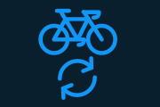
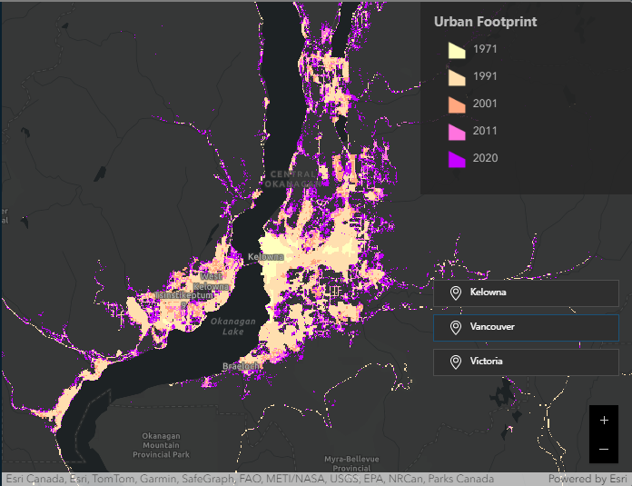
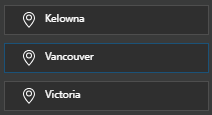
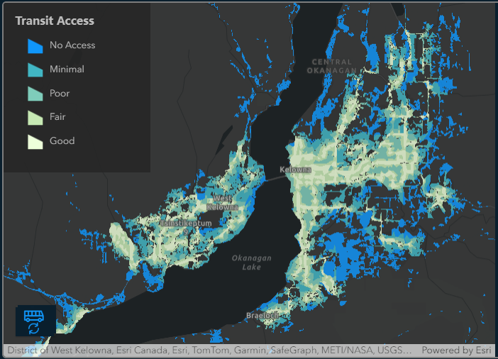

# Urban Reach: Growth & Accessibility Monitor
# Dead Cartographers Society (DCS)

## Team Members
 Carl Wittmann: Data Management and Research Lead
 Eli Schwanitz: Concept, App Development and UI Lead
 Samuel McAllister: Project Management, Documentation & Video Lead

## Mission Statement
 As urban expansion continues to boom in Canada, concerns are being raised at all levels of government regarding the issue of transportation and accessibility. If the increase of urban spread precedes the implementation of proper transit infrastructure, not only are the accessibility needs of many citizens neglected, but environmental concerns, such as a car-dependent culture, begin to rise. In response to this, on July 23, 2023, the Government of Canada committed to investing $14.9 billion over the following eight years into transit options that are reliable, fast, affordable and clean to match the growing needs of an expanding urban landscape. This funding is still primarily dedicated to catching up. To combat persistent accessibility inequities in high-growth regions, transit and bike access must be built alongside new developments. Rather than an afterthought, they must be treated like road access or sewer connectivity as a compulsory part of the planning process.
 The mission of DCS is to evaluate accessibility to public transit and safe biking trails within areas of rapid urban expansion. Our app, Urban Reach, focuses on three regional districts identified by the province of BC as “high-growth regions”, as listed below:
* Central Okanagan Regional District (Kelowna)
* Greater Vancouver Regional District
* Capital Regional District (Victoria)
 
 Alongside the data, the transportation growth plan for each region is considered to evaluate the strategies being implemented to meet the accessibility needs of urban growth.
 Although the focus of this app is on high-growth regions in BC, the same results are replicable nationwide and could be adapted to highlight other measures of transportation accessibility like footpaths or differentiate between bus and rail access in suburban centers.

## About Our App
 How effectively are cities implementing new transit infrastructure alongside new urban expansion? The Urban Reach app is intended to explore the implications of this question, revealing the degree to which cities are succeeding in providing both public transit and safe bike paths to areas of recent urban expansion. The app also explores the history of urban expansion in target cities and the strategies they currently have in place to address the issue.

 The app itself relies on a wealth of open datasets available nationwide, including historic urban extents, land use classes derived from remote sensing, crowdsourced street networks, transit system data, and bike infrastructure polylines. These datasets were used to analyze different generations of Canadian built up areas and their relationship with transit and bike network service areas. These service areas are then combined with census data to reveal the total population affected by minimal transit or bike accessibility within areas of recent urban expansion.

 Our goal in developing the app was to inform decision-makers in urban development on how well they are meeting the accessibility needs of the population in recently developed areas and enable them to make good decisions when choosing where and how to develop in new regions. For everyday users, we also hope to provide insight on their own proximity to transit and safe bike paths, to assist in making informed decisions when moving, and to provide resources and information that can be used to advocate for comprehensive mobility strategies in their own community.

## User Guide
### What does Urban Reach do?
 How effectively are cities implementing new transit infrastructure alongside new urban expansion? The Urban Reach app is intended to explore the implications of this question, revealing the degree to which cities are succeeding in providing both public transit and safe bike paths to areas of recent urban expansion. The app also explores the history of urban expansion in target cities and the strategies they currently have in place to address the issue.

 The app itself relies on a wealth of open datasets available nationwide, including historic urban extents, land use classes derived from remote sensing, crowdsourced street networks, transit system data, and bike infrastructure polylines. These datasets were used to analyze different generations of Canadian built up areas and their relationship with transit and bike network service areas. These service areas are then combined with census data to reveal the total population affected by minimal transit or bike accessibility within areas of recent urban expansion.

### A Guide to Urban Reach

__Default View__

 The default view of Urban Reach is an interactive dashboard displaying maps of bike access, transit access, and historic urban expansion across three regions of interest. Various charts and statboxes calculate and display important summaries in real time as the user interacts with the maps.

__Map Display__

 The dashboard contains two maps that represent the same geographic area. Navigating one map via zooming, panning, or bookmarks will also navigate the other map so they maintain the same extent. This allows users to compare features in the same geographic space.

 Left map - the Access Map: The map on the left-hand side of the screen is the access map. The total colored area represents all built-up places within our regions of interest, while uncolored areas represent places with no urban development. Zones of the built-up area are colored based on their level of access to public transit or cycling networks. Access is broken down into zones with no access, plus four zones with varying degrees of ease and convenience. For more information on how access was classified, please consult the methodology section.

 The mode switch button in the bottom left allows users to toggle between a map of public transit access and a map of cycling network access. The button will switch to indicate which map is being shown. The title of the currently-displayed map is also shown above the legend.

 

 Right map - the Urban Footprint Map: The map on the right-hand side of the screen is the urban footprint map. It shows how the urbanized area of each region has grown over time. Different bands of color show the boundaries of urban development in specific years. For information on how these areas were determined, please consult the methodology section.

 The bookmark switcher on the right side of the map allows the user to zoom to the full extent of any of the regions of interest.

__Access Charts__

 The Access Charts show how accessibility compares between areas of older or newer urban expansion. For example, the 1991 column represents the total population (according to the 2021 census) that lives in an area that was first urbanized between 1972 and 1991. That column then breaks down what percentage of that population enjoys each level of access.

 The Access Charts update automatically based on the current extent displayed in the maps. To see region-wide statistics for one of the three regions of interest, users can select that region’s bookmark. To view statistics for a particular municipality or neighborhood, users can explore the map using pan and zoom tools and watch the charts update in real-time.

 Hovering over a segment of the chart will display a tooltip indicating the level of access and total population represented by that segment, as well as the percentage of that column the segment makes up.

__StatBoxes__

 The StatBoxes provide summary statistics about the current map extent. The Access Charts and the StatBoxes draw from the same data, meaning that the StatBoxes show important crosstabs for the data being displayed in the Access Charts.

 StatBox 1 shows total population and developed area, which provides insight into the density of the region. 

 StatBox 2 shows how that population is divided across areas of older or newer urban expansion. Within this statbox, the pie chart represents the total population in each zone of the right-hand Urban Footprint Map.

 Hovering over a segment of the chart will display a tooltip indicating the population residing in that zone, as well as the percent of the total population that zone makes up.

 StatBox 3 highlights the state of bike and transit accessibility in areas that were recently built up. For this statbox, areas of “recent urban expansion” are areas where development was first observed on or after 2011. These areas correspond to the 2020 and 2011 segments from the pie chart in StatBox 2. "Insufficient access" means areas that are not meeting the UN's Sustainable Development Goal for transit access.

## Project Methodology & Strategy

 As a general rule for this project, we wanted to use data that was available nationwide as much as possible so that it could be replicated consistently for different regions of analysis. Though the methodology below depicts the processing and visualization of specific high-growth regions within the province of British Columbia, these methods could be employed for regional data across Canada. However, some of the datasets used are limited in scope to major metropolitan areas, most notably the historical development generations layer.

__A note on census geographies:__

 Three different levels of census geography were used in this analysis. Each of these are statistical geographies, and are used to report census information at varying resolutions.

 Dissemination Blocks (DBs) are the smallest unit of census geography, comparable to a single city block.

 Dissemination Areas (DAs) consist of one or more DBs, and tend to have a population of 400 to 700.

 Aggregate Dissemination Areas (ADAs) consist of one or more DAs, and tend to have a population between 5,000 and 15,000.

__Development Generations Layer__ 

 The Statistics Canada dataset of built-up areas of human settlement within census metropolitan areas formed the basis of our urban extent data. However, the data only covers the years 1971, 1991, 2001, and 2011.

 We followed the methodology used by Statistics Canada to create a new data layer for the year 2020. The Agriculture and Agri-Food Canada (AAFC) ISO 13191 Land Use data product contains detailed land-use classifications at a 30 x 30 meter resolution for all areas of Canada south of 60° N. Land use classes within this data product include various classes of high-reflectance surfaces that are products of human settlement. 

 The AAFC ISO 13191 Land Use data was clipped to the extents of Census Metropolitan Areas and then reclassified to only display land use classes associated with human settlement. This 2020 layer was then merged with the Statistics Canada dataset. Finally, each year of this dataset was clipped so that the years create concentric rings rather than overlapping polygons. To improve performance, it was also converted from raster to vector format for webmap display.

__Transit Accessibility Layer__

 Creating the transit accessibility layer involved the gathering and processing of two key data elements: Transit Station Point Data and Walkable Pathway Polyline Data.

 The point data was accessible from Translink and BC Transit open data portals. For the walkable route data, we used OpenStreetMap as it seemed to possess the most thorough pathway mapping across all the data sources visited. We used Overpass Turbo to query the regions for the data required which was downloaded as a GeoJSON file.

 Once uploaded to ArcGIS, the pathway attribute data had to be edited so that it could be properly used in service area analysis, but also so it would exclude any pathways with classifications deemed unwalkable, such as “motorway”. We then exported the polyline to a dataset, which we used to create a network dataset. The network dataset was then built and processed using the transit stations as facilities for service area analysis. We broke the service area into 5 levels of access: good, fair, poor, minimal, and none. The border between “fair” and “poor” classification at 500 meters was based off of the UN’s classification of within what distance of a residence a transit station is considered conveniently accessible.

__Bike Accessibility Layer__

 The origins of this bike accessibility layer are in a national bike infrastructure dataset created by researchers at Simon Fraser University. This dataset is a first-of-its-kind, nationwide dataset of all bike infrastructure, classified into high-comfort, medium-comfort, and low-comfort facilities.

 We initially investigated the possibility of identifying key network access points and developing survey areas, similar to how the transit service areas were created. However, some testing and preliminary analysis demonstrated that the linear nature of bikeways does not translate well into a point dataset of access facilities.

 Therefore, we instead relied on an additional dataset for our cycling access levels. The Can-BICS metrics dataset classified 2016 DAs into five levels of cycling access based on length of cycling infrastructure within a distance of that DA. Though this dataset did not have the benefit of using network analysis to calculate access, it is strongly rooted in consultation with local municipalities and our investigation indicated that it is a robust area-based metric for cycling access.

 This dataset was then mapped onto 2021 census geographies using a series of StatCan equivalency files, yielding a cycling access classification for each 2021 DB. These blocks were then also joined to block attributes, which provided population metrics.

__Combining Accessibility Layers with Census Data__

 For the purposes of determining population distribution, we assumed that 100% of the population of each DB lives within the developed area of that block. Of the various population distribution models we tried, this was the most reliable, and our population values were consistently within .05% of measured census values.

 To achieve this, we first intersected a census dissemination block layer with the 2020 urban extent polygon that we derived for the development generations layer. This yielded a layer of DBs, trimmed to only the inhabited parts of those blocks. For each of these blocks, we then calculated population density as (population / polygon area).

 Next, we intersected this population density layer with the development generation rings such that all output polygons had a density attribute and a year of urban expansion.

 In the case of the cycling data, our DB layer already contained access metrics. For the transit access data, we performed an identity operation which preserved the extent of the population density layer and divided the polygons according to their level of transit access. We then calculated population for each resulting polygon as (population density * polygon area).

 Finally, for each access dataset, we aggregated polygons sharing the same access level, year of urban expansion, and ADA. For each aggregation, we calculated the sum of the population attributes of the dissolved polygons, yielding a total population for each aggregation.

__Limitations & Opportunities for Further Study__

__Data__

 Consistent, historical data on built-up area is challenging to source. As a result, our urban expansion boundaries dataset is assembled from multiple sources and sometimes varies across cities within a given year. Though the overall picture is accurate, boundaries within specific neighborhoods or regions may contain inconsistencies, particularly for the 1971 and 1991 boundaries.

__Technical__

 Population calculations within transit and bike access zones were performed using Dissemination Blocks (DBs) for the greatest possible accuracy. However, for app performance purposes, population data in the output is presented at the Aggregate Dissemination Area (ADA) level. Calculating at the DB level and aggregating up to ADAs did produce better results than calculating at the ADA level from the outset. In the app, ADAs make for a reasonable unit of analysis in dense urban cores, but are too blunt an instrument to provide granular data on the urban fringes.

__Methodological__

 Due to time constraints, our investigation leaves out one of the oldest and most time-honored means of travel: walking. Future contributors could enhance our study by creating a walkability metric and comparing it against our cycling and transit metrics in recently-developed areas.

 Our transit and bike access zones consider the nearest transit access point and the local bike network density, respectively. Two potentially important aspects of access are left out of this definition:

* Access barriers, such as busy roads, dangerous intersections, or in the case of cycling access, unpaved park trails, may slightly change the service areas. Though we would not expect much change to the service areas as a result of adding access barriers to our model, differences in the output may help identify bottleneck areas where a single bridge or footpath could significantly improve access.
* Destinations, rather than just origin points, are left out of our model. A robust mobility network considering the paths people take when navigating between home, work, leisure, or other locations was outside the scope of our project. Being able to get on a bus or bike path quickly is not necessarily the same thing as having a convenient route via bus or bike to your destination. There is an opportunity for further study into whether existing transit and cycling networks systemically fail to connect certain neighborhoods with the places people in those neighborhoods are trying to go.

 Though British Columbia is a rapidly growing and changing province, the story of urban expansion here is likely different from that story in other regions across Canada. Further, trends observed in major cities are very different from those in smaller towns or rural regions that are also experiencing rapid urban expansion. Our methodology, and many of our data sources, could also be applied to other locations across the country for a more complete picture of the relationship between accessibility and urban expansion.

## Geospatial Open Data Sources
__Geospatial datasets used in analysis:__
##### [Canadian Built Up Areas](https://www150.statcan.gc.ca/n1/pub/16-201-x/2016000/section_3-eng.htm)
##### [Canadian Land Use Classification](https://open.canada.ca/data/en/dataset/fa84a70f-03ad-4946-b0f8-a3b481dd5248)
##### [Walkable Pathways in Canada](https://www.openstreetmap.org/)
##### [Translink Transit Stations](https://www.translink.ca/about-us/doing-business-with-translink/app-developer-resources/gtfs/gtfs-data)
##### [BC Transit Bus Stops](https://www.bctransit.com/open-data/)
##### [Canadian Census Boundaries](https://www12.statcan.gc.ca/census-recensement/2021/geo/sip-pis/boundary-limites/index2021-eng.cfm?year=21)
##### [Canadian Bikeway Infrastructure Data (Can-BICS)](https://www.canada.ca/en/public-health/services/reports-publications/health-promotion-chronic-disease-prevention-canada-research-policy-practice/vol-40-no-9-2020/canbics-classification-system-naming-convention-cycling-infrastructure.html)
##### [Canadian Bike Access (Can-BICS metrics)](https://www150.statcan.gc.ca/n1/pub/82-003-x/2022010/article/00001-eng.htm)
##### For more information on the Can-BICS project, please visit [their storymap](https://storymaps.arcgis.com/stories/a20689f708d940f1abd1492877f7b1e4)
__Tabular Data__
##### [Census Geography Attributes](https://www12.statcan.gc.ca/census-recensement/2021/geo/aip-pia/geosuite/index2021-eng.cfm?Year=21)
##### [Census Correspondence File](https://www12.statcan.gc.ca/census-recensement/2021/geo/aip-pia/correspondence-correspondance/index2021-eng.cfm?year=21)
## References
__Writing Material__
##### Naël Shiab & Isabelle Bouchard. (2022). [We used AI to measure Canada’s urban sprawl.](https://ici.radio-canada.ca/info/2022/03etalement-urbain-densite-population-villes-transport-commun-changements-climatiques/en?tz=PST)
##### Christopher Jones & Daniel Kammen. (2013). [Spatial Distribution of U.S. Household Carbon Footprints Reveals Suburbanization Undermines Greenhouse Gas Benefits of Urban Population Density.](https://rael.berkeley.edu/wp-content/uploads/2015/04/Jones-Kammen-EST_proof-NationalCarbonMap.pdf)
##### World Bank & City Form Lab. (2012). [Measuring growth and change in metropolitan form.](https://cityform.mit.edu/files/Measuring_Growth_and_Change_in_Metropolitan_Form.pdf)
##### City of Kelowna. (2018). [Imagine Kelowna: The vision to 2040.](https://www.kelowna.ca/sites/files/1/docs/related/imagine_kelowna_short_report_digital.pdf)
##### City of Kelowna. (2022, January.) [2040 official community plan.](https://www.kelowna.ca/our-community/planning-projects/2040-official-community-plan)
##### City of Kelowna. (2022, January). [2040 transportation master plan.](https://kelownapublishing.escribemeetings.com/filestream.ashx?DocumentId=36466)  
##### BC Transit. (2011, May). [Transit future plan: Victoria region.](https://www.bctransit.com/wp-content/uploads/801/337/VIC201105_VictoriaRegion_Transit_Future_Plan.pdf) 
##### Statistics Canada. (2022). [Canada's large urban centres continue to grow and spread.](https://www150.statcan.gc.ca/n1/daily-quotidien/220209/dq220209b-eng.htm)
##### Government of Canada. (2023). [Building Canada's public transit future: Healthy and sustainable modes of transportation for all.](https://www.infrastructure.gc.ca/transit-transport/index-eng.html)
##### Government of British Columbia. (2023). [Status of regional growth strategies.](https://www2.gov.bc.ca/gov/content/governments/local-governments/planning-land-use/local-government-planning/regional-growth-strategies/status-of-regional-growth-strategies)
##### CBC. (2022). [The fastest growing population centres in Canada are in B.C. — but they're not in Metro Vancouver.](https://www.cbc.ca/news/canada/british-columbia/census-data-population-growth-british-columbia-interior-1.6344994)
##### Statistics Canada. (2020). [Proximity to Public Transportation in Canada's Metropolitan Cities, and related Commuting Data.](https://www150.statcan.gc.ca/t1/tbl1/en/tv.action?pid=2310028601)
##### Statistics Canada. (2023). [Convenient access to public transport in Canada.](https://www150.statcan.gc.ca/n1/daily-quotidien/230711/dq230711b-eng.htm)
##### U.S. Department of Transportation. (2013). [Pedestrian Safety Guide for Transit Agencies](https://safety.fhwa.dot.gov/ped_bike/ped_transit/ped_transguide/ch4.cfm)
__Public Transportation Plans__
##### [Canada](https://www.infrastructure.gc.ca/transit-transport/index-eng.html)
##### [British Columbia](https://ecoplanning.ca/wp-content/uploads/2021/05/2008_Provincial_Transit_Plan_LR-1.pdf)
##### [Vancouver](https://vancouver.ca/files/cov/transportation-2040-draft-directions-2012-june.pdf)
##### [Victoria](https://www.crd.bc.ca/project/regional-transportation)
##### [Kelowna](https://www.kelowna.ca/sites/files/1/docs/parks-rec/final_2012_08_01_regional_at_master_plan_combined.pdf)
__Active Transportation Plans__
##### [Canada](https://www.infrastructure.gc.ca/trans/active-strat-actif-eng.html)
##### [British Columbia](https://www2.gov.bc.ca/gov/content/transportation/transportation-environment/active-transportation)
##### [Vancouver](https://vancouver.ca/files/cov/active-transportation-promotion-and-enabling-full-plan.pdf)
##### [Victoria](https://www.crd.bc.ca/project/regional-transportation/pedestrian-cycling-master-plan)
##### [Kelowna](https://www2.gov.bc.ca/assets/gov/driving-and-transportation/reports-and-reference/reports-and-studies/okanagan/central-okanagan-integrated-transportation-strategy/co-its-final_strategy.pdf)
## Images
##### 'Bus', by [Fahmi Horizon](https://iconscout.com/free-icon/bus-2255784)
##### 'Bike', by [Elegant Themes](https://iconscout.com/free-icon/bike-138)
##### 'Kelowna Skyline', by [Darren Kirby (bulliver)](https://commons.wikimedia.org/w/index.php?curid=25886997)
##### 'Victoria, BC', by [abdallahh](https://www.flickr.com/photos/22168167@N00/9427458228)
##### 'Vancouver Skyline', by [domo k.](https://www.flickr.com/photos/63305146@N06/6050789513)
##### 'Downtown Vancouver Sunset', by [MagnusL3D](https://www.flickr.com/photos/62632506@N06/6044910841)
##### 'Postcard: Burnaby, BC, c.1970', by [blizzy63](https://www.flickr.com/photos/45379817@N08/30135579342)
##### 'Bus stop near road in countryside' by [Olga Lioncat](https://www.pexels.com/photo/bus-stop-near-road-in-countryside-7245194/)
## Video
##### All videos were sourced from [Pexels](https://www.pexels.com/)
##### 'Canadian Flag' by [Salman Ahmad](https://www.pexels.com/video/canadian-flag-18348255/)
##### 'Drone Footage of Residential Area' by [Everett Bumstead](https://www.pexels.com/video/drone-footage-of-a-residential-area-5442763/)
##### 'Timelapse Videos of Cars Crossing the Second Narrows Bridge' by [Dmitry Varennikov](https://www.pexels.com/video/timelapse-videos-of-cars-crossing-the-second-narrows-bridge-6009677/)
##### 'A Pedestrian Traffic Light' by [Kelly](https://www.pexels.com/video/a-pedestrian-traffic-light-5514350/)
##### 'Drone Video of Passenger Trains in Ontario, Canada' by [Braeson Holland](https://www.pexels.com/video/drone-video-of-passenger-trains-in-ontario-canada-13580744/)
##### 'Daytime City Traffic' by [Everett Bumstead](https://www.pexels.com/video/daytime-city-traffic-5535905/)
##### 'Traffic on a Highway in Downtown Toronto, Canada' by [Braeson Holland](https://www.pexels.com/video/traffic-on-a-highway-in-downtown-toronto-canada-13580742/)
##### 'Aerial Footage of Cars on Mountain Road' by [Rhys Abel](https://www.pexels.com/video/aerial-footage-of-cars-on-mountain-road-7400102/)
##### 'The Skyline Of Vancouver Canada At Daytime' by [Almond Tree](https://www.pexels.com/video/the-skyline-of-vancouver-canada-at-daytime-4898681/)
##### 'A Video Footage of Busy Street' by [Camilo Calderón](https://www.pexels.com/video/a-video-footage-of-busy-street-4997787/)
##### 'Person Passing On a Pedestrian Lane' by [MART PRODUCTION](https://www.pexels.com/video/person-passing-on-a-pedestrian-lane-7706079/)
##### 'Clouds Over Vancouver' by [Everett Bumstead](https://www.pexels.com/video/clouds-over-vancouver-11331080/)
##### 'Bikers And Joggers On A Restricted Lane' by [Athena](https://www.pexels.com/video/bikers-and-joggers-on-a-restricted-lane-3002452/)
##### 'A Busy Downtown Intersection in Montreal' by [German Korb](https://www.pexels.com/video/a-busy-downtown-intersection-in-montreal-4586095/)
##### 'Driving in the City' by [German Korb](https://www.pexels.com/video/driving-in-the-city-4435292/)
##### 'Video of a Moving Train' by [Eun Suk](https://www.pexels.com/video/video-of-a-moving-train-6163368/)
##### 'Traffic On An Intersection Road In A City' by [Taryn Elliott](https://www.pexels.com/video/traffic-on-an-intersection-road-in-a-city-3121459/)
##### 'View Of City In Timelapse Mode' by [Amit](https://www.pexels.com/video/view-of-city-in-timelapse-mode-1654216/)

## Music
##### 'Getting Ready' by Ahjay Stalino on [Mixkit](https://mixkit.co/)
